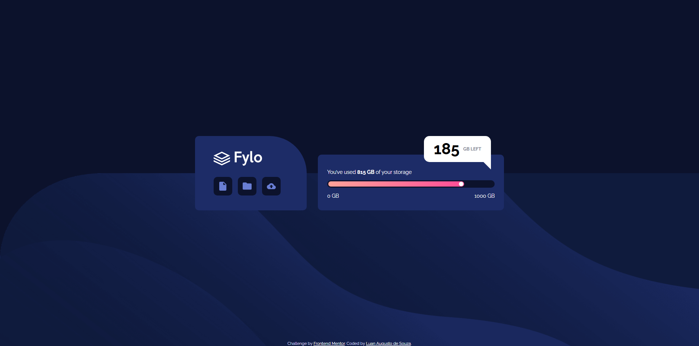

# Frontend Mentor - Solução do componente de armazenamento de dados Fylo

Esta é uma solução para o [Fylo data storage component challenge on Frontend Mentor](https://www.frontendmentor.io/challenges/fylo-data-storage-component-1dZPRbV5n).  
Os desafios do Frontend Mentor ajudam você a melhorar suas habilidades de programação construindo projetos realistas.

## Tabela de conteúdos

  - [O desafio](#o-desafio)
  - [Captura de tela](#captura-de-tela)
  - [Links](#links)
  - [Construído com](#construído-com)
  - [O que aprendi](#o-que-aprendi)
  - [Autor](#autor)

### O desafio

Os usuários devem ser capazes de:

- Visualizar o layout ideal do site dependendo do tamanho da tela do dispositivo

### Captura de tela

### Links

- URL da solução: [Ir para a solução](https://www.frontendmentor.io/solutions/responsive-css-page-using-flexbox-and-grid-wzH1YjyCtI)  
- URL do site ao vivo: [Ir para o site](https://fylo-data-storage-front-end-me-git-5f8099-luan-asouzas-projects.vercel.app?_vercel_share=soLKNIlavtmxbuQwbuo80JAlxmrDtjnG)

### Construído com

- Marcação semântica HTML5  
- Propriedades personalizadas de CSS  
- Flexbox  
- CSS Grid  
- Fluxo *mobile-first*

### O que aprendi

"Aprendi a criar triângulos com CSS e a lidar melhor com imagens de fundo. Também aprendi a construir barras de progresso e a desenvolver melhor a responsividade da página."

## Autor

- Frontend Mentor - [@Luan-ASouza](https://www.frontendmentor.io/profile/Luan-ASouza)
